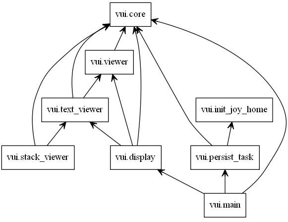

.. Joy VUI documentation master file, created by
   sphinx-quickstart on Mon May 06 19:41:42 2019.
   You can adapt this file completely to your liking, but it should at least
   contain the root `toctree` directive.

Welcome to Joy VUI's documentation!
===================================

A simple Graphical User Interface for the Joy programming language,
written using Pygame to bypass X11 et. al., modeled on the Oberon OS, and
intended to be just functional enough to support bootstrapping further Joy
development.

Screenshot
-----------------------------
.. image:: _static/Joy-VUI-screenshot.PNG

If you have PyGame and Dulwich installed you should be able to start the
VUI with the following command:

::

    python -m joy.vui

This will create a `~/.thun` directory in your home dir to store your
data.

Modules
-----------------------------

.. toctree::
   :maxdepth: 2
   :caption: Contents:
   
   core
   display
   viewer
   text_viewer
   stack_viewer
   persist_task

Indices and tables
==================

* :ref:`genindex`
* :ref:`modindex`
* :ref:`search`
