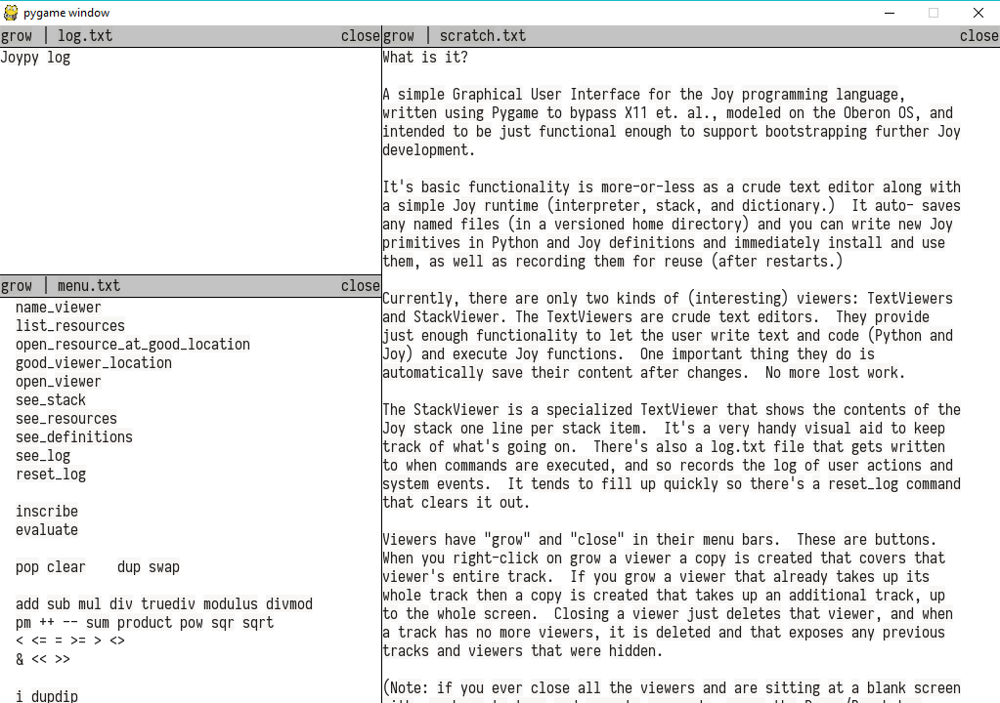

.. Joy VUI documentation master file, created by
   sphinx-quickstart on Mon May 06 19:41:42 2019.
   You can adapt this file completely to your liking, but it should at least
   contain the root `toctree` directive.

Welcome to Joy VUI's documentation!
===================================

.. toctree::
   :maxdepth: 2
   :caption: Contents:

.. automodule:: joy.vui.core
   :members:

.. automodule:: joy.vui.display
   :members:

.. automodule:: joy.vui.viewer
   :members:

.. automodule:: joy.vui.text_viewer
   :members:

.. automodule:: joy.vui.stack_viewer
   :members:

Indices and tables
==================

* :ref:`genindex`
* :ref:`modindex`
* :ref:`search`
